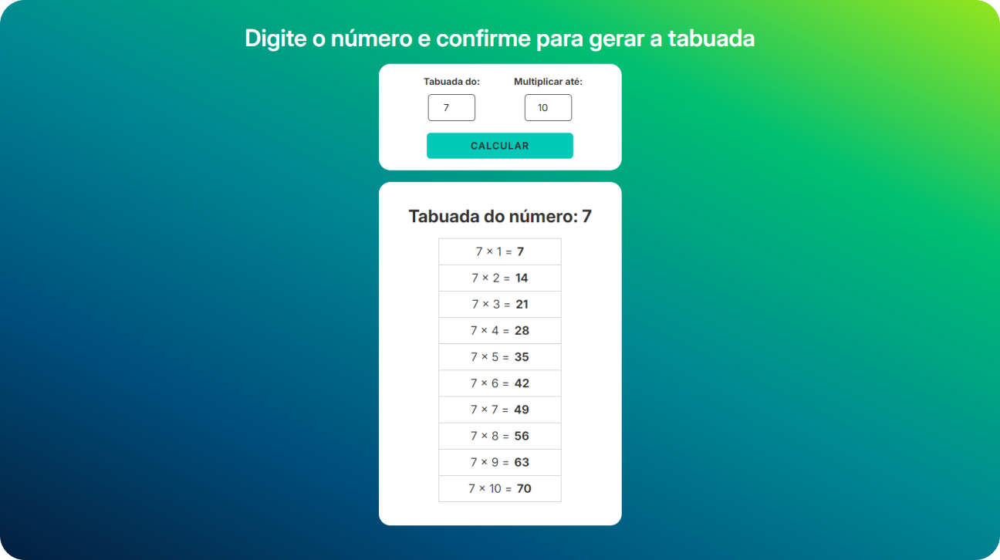

# 🔢 Projeto Tabuada com JavaScript 

    <h3>🎯 Sobre o Projeto</h3>
    Este é o primeiro projeto utilizando <strong>JavaScript</strong>, focado em criar uma aplicação de multiplicação dinâmica, manipulando o DOM e gerando conteúdo interativo via <code>DOMParser</code>.

 

## 👨🏾‍💻 Desafio do Projeto
 
Utilizamos a DOMParser para manipular templates HTML diretamente em JavaScript, convertendo strings em elementos DOM reais.

 

## 📸 Screenshots

 

## 🏆 Aprendizados 

- Validação Simples de Inputs
- Eventos e Interatividade
- Manipulação do DOM com JavaScript
- Uso de Template Literals para Geração de HTML

 

## 🚀 Tecnologias Utilizadas

- JavaScript (ES6)
- HTML5
- CSS3

 

## 🔗 Projeto On-line
Este projeto está disponível para visualização on-line.  
Você pode acessá-lo através do link: https://tabuada-com-java-script.vercel.app/

##

    Este projeto foi desenvolvido como parte do curso <strong>Formação Front-end - HTML, CSS, JavaScript, React e +</strong>, ministrado por <strong>Matheus Battisti</strong> da Escola de Programação <strong>🕒 Hora de Codar</strong>.

